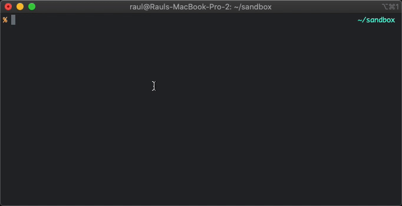

# Sub-TV

> Download Movies and Series subtitles via a intuitive node CLI.

<p align="center">
  
  <p align="center">
    
    <a href="https://david-dm.org/raulfdm/sub-tv" title="dependencies status">
    </a>
  </p>
</p>

## Motivation

Search subtitles may be a easy task, but it can be better. We are used to access our favorite subtitles website, fill fields, click on links, buttons, etc... But wait! Look below how easy it can be:

<p align="center">
  
</p>

## Subtitles Provider

This CLI uses [`open-subtitles`](https://www.opensubtitles.org/) as provider. They have [an API](https://trac.opensubtitles.org/projects/opensubtitles/wiki/XMLRPC) to help us (devs) to create apps on top of they resource.

Because their API is protected by user Token they provide you via requirement, I had to create a server (to hold my personal key) and be a middleware for this CLI.

## How use

I'd suggest you install globally, since the idea is to reuse more than once:

```bash
yarn global add sub-tv

# Of if you're npm person
npm i -g sub-tv
```

Refresh your terminal section (or open another tab) and call the CLI:

```bash
subtv
```

A prompt will appears and ask you a bunch of questions (as you can see in the initial gif). When all questions got answered and the subtitles desired selected, they will be download in the same folder you call `sub-tv` CLI.

## Issues

Having some problem? Please report via GH Issue :)

## License

[MIT License](https://github.com/afonsopacifer/open-source-boilerplate/blob/master/LICENSE.md) © [Raul Melo](https://rauldemelo.com.br)
